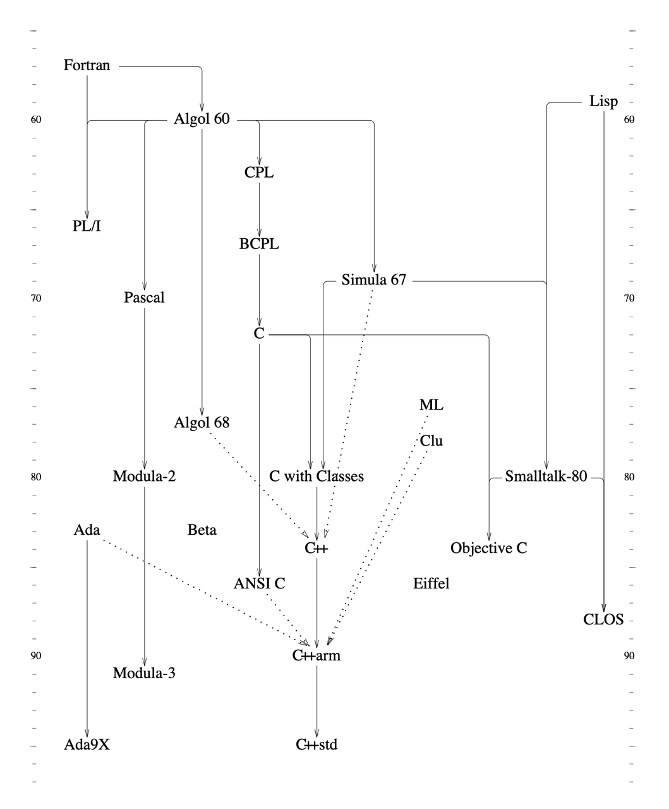

# C++：走向现代化

> 本文主要内容整理自本贾尼·斯特劳斯特卢普（Bjarne Stroustrup）发表的著作和论文，相关内容参见文末参考资料。

## 0. 当我们说 C++ 的时候，我们在说什么

对用户而言，“C++”不只是由标准定义的程序设计言，而是由很多部分组成的集合，不限于：

- 由标准定义的语言规范
- 标准库
- 其它的库
- 大量的（遗留）代码库
- （包括其他语言开发的）工具
- 教学和培训资源
- 社区支持

## 1. C++ 简史


> C with Classes -> C84 -> Release 1.0(Cfront) -> Release 1.2(Cfront) -> Release 2.0(Cfront) -> ARM -> C++98(std) -> C++03(std) -> C++11(std) -> C++14(std) -> C++17(std) -> C++20(std)

- 1979: Start of work on “C with Classes” that became C++; first non-research user;
  - Language: `class`es, constructors/destructors, `public`/`private`, simple inheritance, function argument type checking
  - Library: `task`s (coroutines and simulation support), `vector` parameterized with macros
- 1985: First commercial release of C++; TC++PL1
  - Language: `virtual` functions, operator overloading, references, const
  - Library: `complex` arithmetic, stream I/O
- 1989-91: ANSI and ISO standardization start; TC++PL2
  - Language: abstract classes, multiple inheritance, exceptions, templates
  - Library: iostreams (but no `task`s)
- 1998: C++98, the first ISO C++ standard, TC++PL3
  - Language: `namespace`s, named casts, `bool`, `dynamic_cast`
  - Library: the STL (containers and algorithms), `string`, `bitset`
- 2011: C++11, TC++PL4
  - Language: memory model, `auto`, range-`for`, `constexpr`, lambdas, user-defined literals, ...
  - Library: `thread`s and locks, `future`, `unique_ptr`, `shared_ptr`, `array`, time and clocks, random numbers, unordered containers (hash tables), ...
- 2014: C++14
  - Language: generic lambdas, local variables in `constexpr` functions, digit separators, ...
  - Library: user-defined literals, ...
- 2017: C++17
  - Language: structured bindings, variable templates, template argument deduction from constructors, ...
  - Library: file system, `scoped_lock`, `shared_mutex` (reader-writer locks), `any`, `variant`, `optional`, `string_view`, parallel algorithms, ...
- 2020: C++20
  - Language: `concept`s, `module`s, coroutines, three-way comparisons, improved support for compile-time computation, ...
  - Library: concepts, ranges, dates and time zones, `span`, formats, improved concurrency and parallelism support, ...

## 2. 传统 C++ 的设计规则



### 2.1. 设计目标（Aims）

C++ 使认真的人更享受编程的乐趣
> C++ makes programming more enjoyable for serious programmers

C++ 是一个通用程序设计语言，它更倾向于系统编程，并且
> C++ is a general-purpose programming language with a bias towards systems programming that

- 是更好的 C（is a better C）
- 支持数据抽象（supports data abstraction）
- 支持面向对象编程（supports object-oriented programming）
- 支持泛型编程（supports generic programming）

### 2.2. 一般性规则（General Rules）

- C++ 的发展必须由实际问题推动
- 不应被牵涉到无益的对完美的追求中
- C++ 必须是现在就有用的
- 每个特征必须存在一种合理的明显实现方式
- 总是提供一个变通的方法
- **C++ 是一种语言，而不是一个完整的系统**
  > 一个程序设计环境包含了许多部分，一种方式是将多个部分组合成一个“集成化的”系统，另一种方式是维持系统中各部分之间的经典划分，例如编译器、连接器、语言的运行支持库、I/O库、编辑器、文件系统、数据库，等等。C++遵循的是后一条路。  
- 为每种应该支持的风格提供全面支持
- 不试图去强迫人做什么
  > 程序员都是聪明人:)，总能找到方法绕过觉得无法接受的规则和限制。

### 2.3. 支持设计的规则（Design Support Rules）

- 支持健全的设计概念
- 为程序的组织提供各种机制
- 直接说出你的意思
  > 允许用语言本身表达所有重要的东西，而不是在注释或者通过宏这类黑客的手段。
- 所有的特征都必须是能负担的
- 允许一个有用的特征比防止各种错误使用更重要
- 支持从分别开发的部分出发进行软件组合

### 2.4. 语言的技术性规则（Language-Technical Rules）

- 不隐式地违反静态类型系统
- 为用户定义类型提供与内部类型同样好的支持
- 局部化是好事情
- 避免顺序依赖性
- 如果有疑问，就选择该特征的最容易说清楚的形式
- 语法是重要的（常以某些我们不希望的方式起作用）
- 清除使用预处理程序的必要性
  > 支持Low-Level编程的规则（Low-Level Programming Support Rules）
- 使用传统的（dumb）连接器
  > 好的连接兼容性：容易移植，容易与用其它语言编写的软件互操作。
- 没有无故的与C的不兼容性
- 不为比C++低级的语言保留生存空间（除了汇编）
  > 同时提供低级特征和抽象机制
- 不为不使用的特性付出代价（zero-overhead rule）
- 为存疑的东西提供人工介入的手段
  > 比如模版的特化

## 3. C++ in 2006

### 3.1. 环境的改变

- 单处理器（单核）性能增长放缓，能效成为关键指标
- 硬件供应商绑定开发语言，平台分立（Smart phone）
- 新老项目都在向更时髦的平台转移
- 学校教学和考试更青睐Java，C++课程教学质量下降

### 3.2. C++ vs Java & C\#

C ++ 基于“程序设计语言与底层操作系统分离”的传统模型，由众多独立工具供应商提供支持。而托管语言往往是专有的，由强大的组织支持。该组织开发庞大的基础架构和库，以供开发者使用。
> C++ is based on the traditional model of a programming language separate from the underlying operating system and supported by a multitude of independent tool suppliers. The managed languages tended to be proprietary; only a large and rich organization could develop the massive infrastructure and libraries required.

### 3.3. Java & C# 的观点

- 低级（low level）的需求应该由少量的 C 或汇编完成；
- 高级（high level）的需求应该由具有广泛运行时支持的、安全的、带垃圾回收的语言完成，这样更好、更低价、更高效；
- Java 和 C# 这样的托管语言，提供垃圾回收和运行时检查，使专家程序员更高产，也使入门更简单；
- 程序设计语言要和平台深度集成，集成工具集对于构建大型系统和提高生产效率是必不可少的。

### 3.4. C++ 的劣势

- 工具链上手门槛高
- 接口灵活性和 ABI 稳定性不可兼得
- C++ 标准委员会具有大组织的通病

## 4. C++11: It Feels Like a New Language

支持并发，简化编码（开发），增强泛型编程，静态安全类型扩充，对创建工具库的支持，标准库扩充

### 4.1. 语言特性

- 内存模型：基于现代硬件环境，针对并发的高效 low-level 模型
  > memory model - an efficient low level-model of modern hardware as a foundation for concurrency
- `auto`和`decltype`：简化类型声明
- range-`for`：简化范围迭代
- 移动（move）语义和右值引用：减少数据拷贝次数
- 统一的初始化：一致的对象和内置类型的语法（语义）
- `nullptr`：空指针语义（类型和值两方面）
- `constexpr`函数：编译期求值函数
- 用户定义字面量：用户定义类型的字面量
- 原始字符串字面量：不转义字符
- 属性（attributes）：本质上是关联任意信息和名字
- lambdas：匿名函数对象
- 可变参数模板（variadic `template`s）：可以处理不定数量任意类型参数的模板
- 模板别名：重命名，并绑定模板参数
- `noexcept`：担保函数不会抛出异常
- `override`和`final`：用于类继承的语法扩充
- `static_assert`：编译期断言
- `long long`：更宽的整型
- 成员默认初始值：不用通过构造函数初始化列表设置成员默认值
- `enum class`es：带作用域的强类型枚举

### 4.2. 标准库

- `unique_ptr`和`shared_ptr`：实践 RAII 的资源管理指针
- 内存模型和原子量（atomic）
- `thread`，`mutex`，`condition_variable`：类型安全且可移植的系统级并发支持
- `function`，`bind`：通用函数封装器
- `future`，`promise`，`packaged_task`：轻量的高级并发工具
- `tuple`：匿名的基础复合类型
- 类型萃取（type traits）：用于元编程的类型属性识别
- 正则表达式
- 随机数：支持多种生成器和数据分布
- 时间（Time）：`time_point`和`duration`
- `unordered_map`等：哈希表
- `forward_list`：轻量级链表
- `array`：长度可知的固定长度数组
- 花括号（emplace）运算：构造容器时避免对象拷贝
- `exception_ptr`：跨线程传递异常

## 5. C++14: Completing C++11

ABI稳定，无痛升级

### 5.1. 语言特性

- 二进制字面量：`0b1001000011110011`
- 数字分隔符：增强可读性，`0b1001’0000’1111’0011`
- 变量模板：参数化常量和变量
- 函数返回值类型推导
  > 对 c++11 中 lambda 返回值类型推导的推广
- 泛型lambda
- `constexpr`函数支持局部变量
- 移动（move）捕获：`[p = move(ptr)] { /* ... */ };`
- 带类型的tuple访问：`x = get<int>(t)`;
- 标准库支持用户定义字面量：[`basic_string`](https://zh.cppreference.com/w/cpp/string/basic_string)、[`duration`](https://zh.cppreference.com/w/cpp/chrono/duration)与[`complex`](https://zh.cppreference.com/w/cpp/numeric/complex)

## 6. C++17: Lost at Sea

新特性很多，但没有重大改进

### 6.1. 语言特性

- [类模板实参推导](https://zh.cppreference.com/w/cpp/language/class_template_argument_deduction)：简化对象定义
- 推导原则（guides）：用于消除构造函数模板参数类型推导歧义的精确符号
- [结构化绑定](https://zh.cppreference.com/w/cpp/language/structured_binding)： 简化表示，并消除一个可能引起变量未初始化问题的源

```c++
auto [x,y,z] = f();  // call syntax, introducing aliases
```

- [`inline`变量](https://zh.cppreference.com/w/cpp/language/inline)：简化仅头文件的库中具有静态存储期的变量的使用
- [折叠表达式](https://zh.cppreference.com/w/cpp/language/fold)：简化变参模板的使用
- 判断（[`if`](https://zh.cppreference.com/w/cpp/language/if)、[`switch`](https://zh.cppreference.com/w/cpp/language/switch)和[`while`](https://zh.cppreference.com/w/cpp/language/while)）语句中的初始化器：类似for语句
- 强制的[复制消除](https://zh.cppreference.com/w/cpp/language/copy_elision)：消除一些多余的拷贝运算
- 更严格的[求值顺序](https://zh.cppreference.com/w/cpp/language/eval_order)：防止一些细微的求值顺序错误
- `auto`占位的非类型[模板形参](https://zh.cppreference.com/w/cpp/language/template_parameters)：值模板参数类型推导
- 捕获通用错误的新[属性](https://zh.cppreference.com/w/cpp/language/attributes)：`[[maybe_unused]]`, `[[nodiscard]]`, and `[[fallthrough]]`
- 十六进制浮点字面量
- 编译期的[`constexpr if`语句](https://zh.cppreference.com/w/cpp/language/if)：简化编译期求值代码

### 6.2. 标准库

- `optional`，`variant`，`any`：表示可选值的标准库类型
- `shared_mutex`，`shared_lock`（读写锁），`scoped_lock`（加多个锁，且不会引发死锁）
- 并行STL：标准库算法的多线程和/或向量化版本
- 文件系统：操纵文件系统的路径和目录的可移植方式
- `string_view`：引用（非所属的）不可变字符序列
- [数学特殊函数](https://zh.cppreference.com/w/cpp/numeric/special_functions)：Laguerre多项式，Legendre多项式，beta函数，黎曼zeta函数

## 7. C++20: A Struggle for Direction

继C++11后的又一重大突破

### 7.1. 主要特性

- Concepts：specification of requirements for generic code
- Modules：support for modularity for code hygiene and improved compile times
- Coroutines：stackless coroutines
- Compile-time computation support
- `<=>`：a three-way comparison operator
- Ranges：a library flexible range abstractions
- Date：a library providing date types, calendar, and time zones
- Span：a library providing efficient and safe access to arrays
- Format：a library providing type-safe printf-like output
- Concurrency增强：such as scoped threads and stop tokens

### 7.2. 次要特性

- C99-style designated initializers
- Refinements to lambda capture
- Template parameter lists for generic lambdas
- Initialization of an additional variable within a range-for
- Lambdas in unevaluated contexts
- Pack expansions in lambda capture
- Removing the need for `typename` in some cases
- More attributes: `[[likely]]` and `[[unlikely]]`
- `source_location` to give the source code location of a piece of code without the use of macros
- Feature test macros
- Conditional `explicit`
- Signed integers are guaranteed to be two’s complement
- Mathematical constants, such as `pi` and `sqrt2`
- Operations on bits, such as rotations and counting ones

## 8. C++23

### 8.1. 开发中的特性

- Networking and executors
- Contracts：assertions, preconditions, and postconditions
- Static reflection：facilities for generating code based on the surrounding program
- Pattern Matching：selecting code to be executed based on types and object values

## 参考资料

1. [The Design and Evolution of C++](https://www.stroustrup.com/dne.html)
2. [C++ in 2005](https://www.stroustrup.com/DnE2005.pdf)
3. [Thriving in a Crowded and Changing World: C++ 2006–2020](https://www.stroustrup.com/hopl20main-p5-p-bfc9cd4--final.pdf)
4. [Standard C++ Foundation 官方网站](https://isocpp.org/)
5. [C++ Core Guidelines](http://isocpp.github.io/CppCoreGuidelines/CppCoreGuidelines)（中文翻译：[lynnboy/CppCoreGuidelines-zh-CN](https://github.com/lynnboy/CppCoreGuidelines-zh-CN/blob/master/CppCoreGuidelines-zh-CN.md)）
6. [C++ 参考手册](https://zh.cppreference.com/w/cpp)
7. [现代 C++ 教程: 高速上手 C++ 11/14/17/20](https://changkun.de/modern-cpp/)
