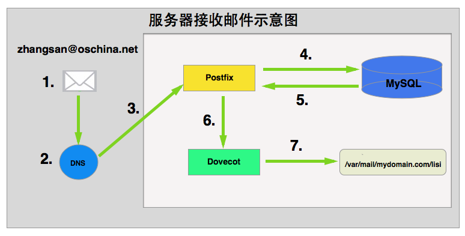
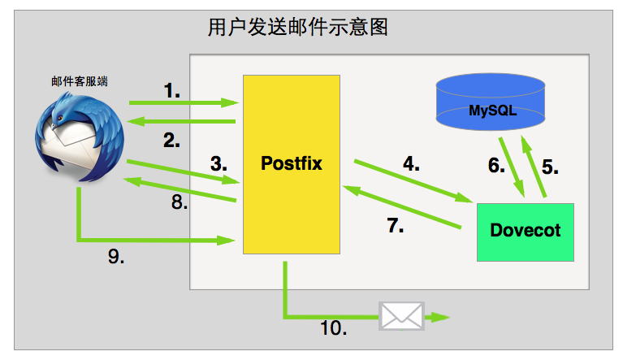
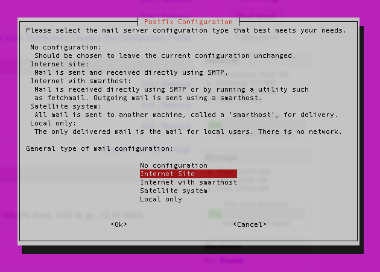

# 使用Postfix+Dovecot+MySQL搭建邮件服务器

> 转载自 <http://my.oschina.net/baratsemet/blog/413923>（链接已失效）  
> 补链：<https://www.open-open.com/lib/view/open1431592348122.html>

网上有很多使用Postfix搭建邮件服务器的文章，但目前貌似没有看到较为完整的一篇。本例将尝试在Ubuntu系统中使用Postfix+Dovecot+MySQL搭建邮件服务器。

说到邮件服务器，网上有许多不同解决方案。Window操作系统下常见的邮件服务器有hMailServer、[MailEnable](http://www.mailenable.com)、[EVOMailServer](https://www.evomailserver.com)、[Apache James(纯Java跨平台)](http://james.apache.org)等。

而在Linux/Unix系统中常用的邮件服务器也有不少选择，最经典也是最常见的莫过于Postfix。这篇文章将会讲述如何在Ubuntu系统之下，通过[Postfix](http://www.postfix.org)、[Dovecot](https://www.dovecot.org)、[MySQL](https://www.mysql.com)整合实现普通意义上「邮件服务器」的大部分功能。

## 开始之前

配置邮件服务器并不是一项简单的工作，其过程不仅需要一定的技术能力，同时也需要大家具有一定的耐心，同时也需要大家非常细心。为了能够「看懂」并「最终实践」这篇文章，大家还需要了解或掌握以下知识：

- **Postfix**：是一个标准的MTA「Mail Transfer Agent」服务器，它负责通过SMTP协议管理发送到本机的邮件以及由本机发向外界的邮件。在本例中，Postfix会把邮件的本地投递工作「接受到邮件之后将邮件存档到本地磁盘」交给Dovecot的LMTP服务「Local Mail Transfer Protocol service」处理。当然，当大家想通过服务器向外界发送邮件时，Postfix还将负责验证权限以确保服务器不被滥用。「很多邮件服务器根本没有对SMTP做用户验证，这将导致任何匿名用户都可以通过服务器向外界发送邮件，从而使得服务器变成垃圾中转站」
- **Dovecot**：是一个非常优秀的IMAP/POP服务器用以接收外界发送到本机的邮件。通常，Dovecot的工作内容包括：验证用户身份以确保邮件不会被泄露。在本例中，Dovecot将负责所有的「身份验证」工作，我们会配置Dovecot查询本地的MySQL数据库以确认用户身份
- **MySQL**：不必多说，它将存储所有的用户信息，其中包括：需要监听的域名信息、用户邮箱地址、登录密码、邮箱别名「alias」等
- **Ubuntu**：本例中的OS将选择Ubuntu14.10作为标准，其他Linux发行版的相关操作不在描述

## 工作原理

### 服务器接收邮件的过程

在开始讲述本例的内容之前，我们先来看看Postfix+Dovecot+MySQL是如何相互协作以实现邮件服务器的各项功能。我们假设张三通过oschina.net的邮箱zhangsan@oschina.net发送一份邮件给李四lisi@mydomain.com，则服务器接收邮件的过程大致如下图所示：



1. zhangsan@oschina.net发送邮件到lisi@mydomain.com
2. `oschina.net`服务器会通过DNS查询`mydomain.com`的MX记录并找到Postfix所在的服务器
3. 邮件被发送给Postfix
4. Postfix转向MySQL求助，以查询`mydomain.com`是不是需要处理的域名
5. MySQL返回确认信息给Postfix
6. Postfix将接受到的邮件投递给Dovecot的LMTP服务以便做处理
7. Dovecot将邮件内容保存到lisi@mydomain.com用户对应的磁盘路径

### 用户查收邮件的过程

上述例子中我们看到了服务器接收邮件的过程，接下来我们看看，当大家通过用户名密码登录邮箱查看邮件时，会发生什么事情：


1. 邮件客户端 to Dovecot：尊敬的Dovecot大人，您好！我阔以建立一个IMAP加密连接吗？
2. Dovecot to 邮件客户端：当然阔以。这是我的SSL证书，请您告诉我帐号和密码！
3. 邮件客户端 to Dovecot：好滴！这是我的用户名和密码，千万不要告诉别人哦！
4. Dovecot to MySQL：Hi 美女！请问下，这个用户名和密码是正确的嘛？
5. MySQL to Dovecot：好的，请稍后！呃……这个用户名和密码是正确的哦！
6. Dovecot打开存放在本地磁盘`/var/mail/mydomain.com/llisi`的mailbox
7. Dovecot获取到最新的邮件及其他相关信息
8. Dovecot将邮件及其相关的其他信息通过IMAP协议发送给客户端

### 用户发送邮件的过程

查收了最新的邮件之后，李四lisi@mydomain.com发现张三给他发来了邮件。现在，李四回复一封邮件给张三，会发生什么事情：



1. 邮件客户端 to Postfix：尊敬的Postfix大人，您好！我阔以建立一个安全的SMTP连接嘛？
2. Postfix to 邮件客户端：说人话！可以就是可以，干嘛要说「阔以」啊！你丫贱啊，找抽啊！想建立SMTP连接可以，不过要加密。这是我的SSL证书，告诉我你的帐号和密码，你个贱人！
3. 邮件客户端 to Postfix：对不起，大人，我错鸟！这是我的帐号和密码，不要告诉别人哦！
4. Postfix to Dovecot：Hi 帅哥，帮我查一下这个帐号和密码！
5. Dovecot to MySQL：Hi 美女，这个帐号和密码是正确的呢？！还是正确的呢？！还是……
6. MySQL to Dovecot：好啦，你乖啦！我查过啦，这个帐号密码是正确的啦！表卖萌哦，Dovecot君！
7. Dovecot to Postfix：大锅，则个帐号密码斯正缺滴！
8. Postfix to 邮件客户端：贱人，过来！你给的帐号密码是正确的，允许你发送邮件！
9. 邮件客户端将编写好的邮件通过SMTP协议发送给Postfix
10. Postfix将收到的邮件转发给对方

以上，大家已经看到邮件收、发的整个过程。接下来看看如何才能成功配置邮件服务器。

## DNS配置

首先，你需要有一个域名。本例中假定我们的域名为`mydomain.com`，以此为基础去做后续的所有工作。

!!! note "请注意"
    在DNS相关配置没有成功之前，请勿尝试后续的操作。即使你配置好了Postfix，只要DNS相关配置没有成功，邮件服务器一样不能正常工作。

其次，登录域名管理系统「强烈推荐使用[DNSPod](https://www.dnspod.cn)做域名管理」，新增几条MX记录指向你的邮件服务器。

第三，关于TTL设置。在测试邮件服务器的过程中，大家大可把TTL时间设置的短一点，这样可以让DNS服务器在很短的时间之内就起作用。当测试阶段过后，请即使将TTL时间设置成较大的值。什么？你问为什么要这样？自己去Google一下看看吧！TTL设置的太短会带来什么安全隐患。

设置完以后，DNS的MX记录及TTL时间大致如下：

```txt
mydomain.com         MX     10      mydomain.com
mydomain.com         MX     10      12.34.56.78
mail.mydomain.com    MX     10      12.34.56.78
```

## SSL证书

关于SSL认证的问题，大家可以根据自己的情况做决定。有人偏向于购买第三方权威的SSL认证，也有人使用OpenSSL自己制作签名（参考：[[create-self-signed-certificate]]）。当然，上述两种方法本质上是没有什么区别的，唯一的区别在于：如果是自己制作的SSL证书，大部分的邮件客户端都会弹出提示框询问是否信任等。

## 修改hostname

哈，终于进入了正题。现在，请大家打开终端「window系统用户可以选择使用putty等ssh工具连接服务器」并连接自己的服务器。

```bash
ssh username@12.34.56.78
```

连接成功以后，请第一时间执行下述命令切换到root用户：

```bash
sudo -s
```

!!! note "请注意"
    为什么要切换到root用户？纯属个人爱好，因为我很懒，懒得每次执行命令时在命令的前面带上sudo这样的参数，因此直接切换到root用户好了。

接下来，在命令行中输入如下命令查看hostname：

```bash
hostname
```

接着，在命令行输入如下命令查看FQDN「fully-qualified domain name」：

```bash
hostname -f
```

将上述两个名称记录下来，安装postfix时你将会使用到。

当然，上述的机器名是可以随时修改的，如果你想要修改，可以直接通过vi编辑器打开/etc/hostname文件，并将自己想要的机器名写入其中并保存即可

## MySQL安装及配置

本例中我们使用MySQL数据库保存Postfix需要服务的虚拟域名、用户帐号及密码、邮件别名三个重要的信息。

!!! note "请注意"
    其实Postfix和Dovecot是完全可以不使用数据库的，二者都可以通过各种配置文件完成「零数据库」的邮件服务器。但是，既然可以使用数据库这么方便，为什么不用呢？将这些需要配置的信息存储在数据库中「如：用户帐号及密码等」，对今后的维护来说是非常方便的事情。不是么？！

### MySQL安装

在Ubuntu种安装软件，是再简单不过的事情了。安装MySQL请在命令行中执行如下命令：

```bash
apt-get install mysql-server
```

安装过程中会需要你输入两次MySQL的root口令，请牢记该口令


### 新建数据库及用户

接下来，我们需要新建一个MySQL用户及一个数据库：

- 使用root口令登录MySQL

```bash
mysql -u root -p
```

- 输入root口令

- 新建一个数据库，名称叫做`mailserver`：

```sql
create database mailserver character set utf8;
```

- 输入如下命令以新建一个用户`mailserver`，并指定密码为`mailserver123`：

```sql
create user mailserver@'localhost' identified by 'mailserver123';
```

- 将数据库`mailserver`的所有权限赋给用户`mailserver`：

```sql
grant all on mailserver.* to mailserver@'localhost' identified by 'mailserver123';
```

- 退出root用户：

```sql
exit;
```

- 使用`mailserver`用户登录：

```sql
mysql -u mailserver -p
```

- 输入`mailserver`帐号的口令

- 将默认数据库切换为`mailserver`数据库：

```sql
use mailserver;
```

### 新建表

- 输入如下SQL语句以新建`virtual_domains`表，该表是本地服务器用以接收邮件的域名：

```sql
CREATE TABLE `virtual_domains` (
  `id` int(11) NOT NULL auto_increment,
  `name` varchar(50) NOT NULL,
  PRIMARY KEY (`id`)
) ENGINE=InnoDB DEFAULT CHARSET=utf8;
```

- 输入如下SQL语句以新建`virtual_users表`，该表邮件服务器的终端用户表，记录用户的邮件地址及密码：

> 千万不要保存明文密码

```sql
CREATE TABLE `virtual_users` (
  `id` int(11) NOT NULL auto_increment,
  `domain_id` int(11) NOT NULL,
  `password` varchar(106) NOT NULL,
  `email` varchar(100) NOT NULL,
  `enable` int(1) NOT NULL DEFAULT '1',
  PRIMARY KEY (`id`),
  UNIQUE KEY `email` (`email`),
  FOREIGN KEY (domain_id) REFERENCES virtual_domains(id) ON DELETE CASCADE
) ENGINE=InnoDB DEFAULT CHARSET=utf8;
```

- 输入如下SQL语句以新建`virtual_aliases`表，该表是邮件服务器别名表：

> 邮件服务器中的别名alias的概念大家可以Google一番

```sql
CREATE TABLE `virtual_aliases` (
  `id` int(11) NOT NULL auto_increment,
  `domain_id` int(11) NOT NULL,
  `source` varchar(100) NOT NULL,
  `destination` varchar(100) NOT NULL,
  PRIMARY KEY (`id`),
  FOREIGN KEY (domain_id) REFERENCES virtual_domains(id) ON DELETE CASCADE
) ENGINE=InnoDB DEFAULT CHARSET=utf8
```

### 插入数据

为了便于查看结果，接下来给上述三张表种插入一些测试数据：

- 给`virtual_domains`表插入测试数据，大致如下：

```sql
insert into virtual_domains(id,name) values(1,'mail.mydomain.com');
insert into virtual_domains(id,name) values(2,'mydomain.com');
```

!!! note "请注意"
    上述表种id字段是自增列，可以不赋值。但无论如何，接下来的两张表种我们将需要上述表种的逐渐列id的值。比如：我将要添加`mydomain.com`域名下的邮箱帐号，而`mydomain.com`在`virtual_domains`表种的id值为2。

- 给`virtual_users`表添加用户数据：

```sql
insert into virtual_users(id,domain_id,password,email) values (1,2,ENCRYPT('123456zhangsan', CONCAT('$6$', SUBSTRING(SHA(RAND()), -16))),'zhangsan@mydomain.com');
insert into virtual_users(id,domain_id,password,email) values (2,2,ENCRYPT('123456lisi', CONCAT('$6$', SUBSTRING(SHA(RAND()), -16))),'lisi@mydomain.com');
```

- 给`virtual_aliases`表添加别名数据：

```sql
insert into virtual_aliases(id,domain_id,source,destination) values (1,2,'all@mydomain.com','zhangsan@mydomain.com');
insert into virtual_aliases(id,domain_id,source,destination) values (1,2,'all@mydomain.com','lisi@mydomain.com');
```

!!! note "请注意"
    通过上述别名表的数据，当有人给all@mydomain.com发送邮件时，系统将自动将邮件转发给zhangsan@mydomain.com和lisi@mydomain.com。这种场景，在公司内部「发送通知」等情况下适用

### 测试数据

写几个SQL查询语句查看下结果吧

```sql
select * from virtual_domains;
select * from virtual_users;
select * from virtual_aliases;
```

## Postfix安装及配置

Postfix是邮件发送的核心服务器，所有向内、向外投递的邮件都需要经过Postfix通过SMTP协议完成。接下来的内容，大家需要修改Postfix相关的一些参数，它们是：

- 告诉Postfix如何连接MySQL数据库，并让Postfix通过数据库种的表确定收发邮件的域名、用户帐号及密码、邮件别名等
- 告诉Postfix将收到的邮件转发给Dovecot的LMTP服务以完成本地投递
- 告诉Postfix所有的连接都需要STARTTLS加密，如果有必要「废话啊，当然必须这样」
- 开放本地端口25、465、587之一或全部

### Postfix的安装

在命令行种执行以下命令以安装Postfix：

```bash
apt-get install postfix postfix-mysql
```

安装过程中需要选择Postfix的类型，请选择Internet Site：



Postfix安装过程中还会需要输入**System mail name**，这里请输入你要收发邮件的域名地址「随便写也可以，反正后面需要修改配置文件」

### Postfix的配置

- 先备份Postfix的配置文件`/etc/postfix/main.cf`！

```bash
cp /etc/postfix/main.cf /etc/postfix/main.cf.bak
```

!!! note "请注意"
    任何时候，对任何配置进行修改之前，先做好备份总是非常必要的。同时，这也是一个非常良好的操作习惯。

- 使用vi编辑器打开`/etc/postfix/main.cf`文件

```bash
vi /etc/postfix/main.cf
```

- 打开之后，按下 **i** 键进入编辑模式。

- 鉴于我们没有打算使用Postfix做用户的权限验证「上述几个图种已经展示清楚」，我们将要把Postfix默认的用户验证参数屏蔽，因此请在如下几行前边加入#符号以注释：

```conf
# TLS parameters
# smtpd_tls_cert_file=/etc/ssl/certs/ssl-cert-snakeoil.pem
# smtpd_tls_key_file=/etc/ssl/private/ssl-cert-snakeoil.key
# smtpd_use_tls=yes
# smtpd_tls_session_cache_database = btree:${data_directory}/smtpd_scache
# smtp_tls_session_cache_database = btree:${data_directory}/smtp_scache
```

- 复制如下内容，并将其插入到上述注释代码之后：

```conf
smtpd_tls_cert_file=/etc/dovecot/dovecot.pem
smtpd_tls_key_file=/etc/dovecot/private/dovecot.pem
smtpd_use_tls=yes
smtpd_tls_auth_only = yes
# Enabling SMTP for authenticated users, and handing off authentication to Dovecot
smtpd_sasl_type = dovecot
smtpd_sasl_path = private/auth
smtpd_sasl_auth_enable = yes
smtpd_recipient_restrictions = permit_sasl_authenticated, permit_mynetworks, reject_unauth_destination
```

!!! note "请注意"
    上述几个参数的含义，请参照[Postfix配置文档](http://www.postfix.org/documentation.html)

- 按照如下方式修改`mydestination`一行的值：

```conf
mydestination = localhost
```

!!! note "请注意"
    将`mydestination`的值修改为`localhost`，以便Postfix能够通过MySQL表中相关数据决定需要接受/发送邮件的域名，这样更具有通用性

- 在文档中加入以下内容，以便告诉Postfix不要使用LDA「Local Delivery Agent」转而使用Dovecot的LMTP完成本地邮件投递：

```conf
# Handing off local delivery to Dovecot's LMTP, and telling it where to store mail
virtual_transport = lmtp:unix:private/dovecot-lmtp
```

- 在文档中加入以下内容，以便告诉Postfix去MySQL数据库种寻找域名、用户帐号密码及邮件别名等信息：

```conf
# Virtual domains, users, and aliases
virtual_mailbox_domains = mysql:/etc/postfix/mysql-virtual-mailbox-domains.cf
virtual_mailbox_maps = mysql:/etc/postfix/mysql-virtual-mailbox-maps.cf
virtual_alias_maps = mysql:/etc/postfix/mysql-virtual-alias-maps.cf
```

- 最终，修改完成以后的`/etc/postfix/main.cf`文件大致应该如下：

```conf
# See /usr/share/postfix/main.cf.dist for a commented, more complete version
# Debian specific:  Specifying a file name will cause the first
# line of that file to be used as the name.  The Debian default
# is /etc/mailname.
# myorigin = /etc/mailname
smtpd_banner = $myhostname ESMTP $mail_name (Ubuntu)
biff = no
# appending .domain is the MUA's job.
append_dot_mydomain = no
# Uncomment the next line to generate "delayed mail" warnings  
# delay_warning_time = 4h
readme_directory = no
# TLS parameters
# smtpd_tls_cert_file=/etc/ssl/certs/ssl-cert-snakeoil.pem
# smtpd_tls_key_file=/etc/ssl/private/ssl-cert-snakeoil.key
# smtpd_use_tls=yes
# smtpd_tls_session_cache_database = btree:${data_directory}/smtpd_scache
# smtp_tls_session_cache_database = btree:${data_directory}/smtp_scache
smtpd_tls_cert_file=/etc/dovecot/dovecot.pem
smtpd_tls_key_file=/etc/dovecot/private/dovecot.pem
smtpd_use_tls=yes
smtpd_tls_auth_only = yes
# Enabling SMTP for authenticated users, and handing off authentication to Dovecot
smtpd_sasl_type = dovecot
smtpd_sasl_path = private/auth
smtpd_sasl_auth_enable = yes
smtpd_recipient_restrictions = permit_sasl_authenticated, permit_mynetworks, reject_unauth_destination
# See /usr/share/doc/postfix/TLS\_README.gz in the postfix-doc package for
# information on enabling SSL in the smtp client.
myhostname = host.mydomain.com
alias_maps = hash:/etc/aliases
alias_database = hash:/etc/aliases
myorigin = /etc/mailname
# mydestination = example.com, hostname.mydomain.com, localhost.mydomain.com, localhost
mydestination = localhost
relayhost = 
mynetworks = 127.0.0.0/8 [::ffff:127.0.0.0]/104 [::1]/128
mailbox_size_limit = 0
recipient_delimiter = +
inet_interfaces = all
# Handing off local delivery to Dovecot's LMTP, and telling it where to store mail
virtual_transport = lmtp:unix:private/dovecot-lmtp
# Virtual domains, users, and aliases
virtual_mailbox_domains = mysql:/etc/postfix/mysql-virtual-mailbox-domains.cf
virtual_mailbox_maps = mysql:/etc/postfix/mysql-virtual-mailbox-maps.cf
virtual_alias_maps = mysql:/etc/postfix/mysql-virtual-alias-maps.cf
```

- 按下ESC键并输入如下内容以保存并退出

```vim
wq!
```

- 新建`/etc/postfix/mysql-virtual-mailbox-domains.cf`文件并输入如下内容：

```conf
user = mailserver
password = mailserver123
hosts = 127.0.0.1
dbname = mailserver
query = SELECT 1 FROM virtual_domains WHERE name='%s'
```

- 重启Postfix服务

```bash
service postfix restart
```

- 测试上述内容是否正确，如果上述内容配置正确，则如下命令执行后返回结果应该为1：

```bash
postmap -q mydomain.com mysql:/etc/postfix/mysql-virtual-mailbox-domains.cf
```

- 新建`/etc/postfix/mysql-virtual-mailbox-maps.cf`文件并输入如下内容：

```conf
user = mailserver
password = mailserver123
hosts = 127.0.0.1
dbname = mailserver
query = SELECT 1 FROM virtual_users WHERE enable=1 AND email='%s'
```

- 重启Postfix服务

```bash
service postfix restart
```

- 测试上述配置是否正确，如果上述内容配置正确，则如下命令执行后返回结果应该为1：

```bash
postmap -q lisi@mydomain.com mysql:/etc/postfix/mysql-virtual-mailbox-maps.cf
```

- 新建`/etc/postfix/mysql-virtual-alias-maps.cf`文件并输入如下内容：

```conf
user = mailserver
password = mailserver123
hosts = 127.0.0.1
dbname = mailserver
query = SELECT destination FROM virtual_aliases WHERE source='%s'
```

- 重启Postfix服务

```bash
service postfix restart
```

- 测试上述配置是否正确，如果上述配置正确，则如下命令执行后返回结果应该是之前添加的别名帐号：

```bash
postmap -q all@mydomain.com mysql:/etc/postfix/mysql-virtual-alias-maps.cf
```

- 使用vi编辑器打开`/etc/postfix/master.cf`文件「请注意修改之前先备份」，找到`submission`和`smtps`所在的两行，并将其注释去掉。这样做的目的是允许Postfix通过587和465端口发送邮件。

- 重启Postfix服务

```bash
service postfix restart
```

搞定，Postfix服务器应该配置完成了。相信到这里的时候，已经吓走了90%以上的朋友，剩下的10%朋友们，你们是好样的。

## Dovecot安装及配置

Dovecot在本例中充当IMAP、POP服务器的角色，同时它也将负责用户登录时用户身份的验证「Dovecot会将真正的验证工作交给MySQL处理」。因为使用SSL，Dovecot将会使用993「IMAP协议」及995「POP协议」与外界交流，若服务器有iptable之类的玩意儿，请开放相关端口。

这部分的内容配置起来相对简单，但是需要配置的文件繁多。大体上，我们需要配置如下的信息：

- 开启Dovecot的IMAP、POP3、LMTP协议
- 告知Dovecot本地邮件的投档路径
- 连接Dovecot和MySQL数据库以验证用户身份
- 配置SSL加密相关信息

### Dovecot的安装

通过如下命令安装Dovecot最新版：

```bash
apt-get install dovecot-core dovecot-imapd dovecot-pop3d dovecot-lmtpd dovecot-mysql
```

### Dovecot的配置

需要修改的配置文件有：

- /etc/dovecot/dovecot.conf : Dovecot的主配置文件
- /etc/dovecot/conf.d/10-mail.conf : Dovecot将要操作的磁盘路径相关配置信息
- /etc/dovecot/conf.d/10-auth.conf : 用户验证相关配置信息
- /etc/dovecot/conf.d/auth-sql.conf.ext : SQL-Type验证相关配置信息
- /etc/dovecot/dovecot-sql.conf.ext : Dovecot与数据库连接相关配置信息
- /etc/dovecot/conf.d/10-master.conf : Dovecot本地socket相关配置信息
- /etc/dovecot/conf.d/10-ssl.conf : 关于SSL的相关配置信息

!!! note "请注意"
    在修改上述文件之前，请一定先做好备份以方便恢复

#### 修改`/etc/dovecot/dovecot.conf`文件

使用vi编辑器打开`/etc/dovecot/dovecot.conf`文件并在文件种加入如下内容：

```conf
!include conf.d/*.conf
# Enable installed protocols
!include_try /usr/share/dovecot/protocols.d/*.protocol
protocols = imap pop3 lmtp
```

如果以上内容已经存在，只需要把该行的\#号去掉即可

上述内容大致的意思是：告诉Dovecot启用所有.conf文件；并开启Dovecot的imap、pop3、lmtp等相关协议使之正常工作

#### 修改`/etc/dovecot/conf.d/10-mail.conf`文件

打开文件并找到`mail_location`相关信息，将其指定到本地磁盘的某个路径，这个路径将来会存放收到的邮件，如下所示：

```conf
mail_location = maildir:/var/mail/vhosts/%d/%n
```

同时，找到文件中`mail_privileged_group`相关信息并将起修改为：

```conf
mail\_privileged\_group = mail
```

保存文件并退出

在命令行种输入如下内容以查看`/var/mail`路径的权限：

```bash
ls -ld /var/mail
```

显示的内容大致应该是：

```txt
drwxrwsr-x 2 root mail 4096 May  11 15:08 /var/mail
```

创建`/var/mail/vhosts/`文件夹给每个需要启用的域名：

```bash
mkdir -p /var/mail/vhosts/mydomain.com
```

输入如下命令以新建`vmail`用户组及用户并赋权限

```bash
groupadd -g 5000 vmail  useradd -g vmail -u 5000 vmail -d /var/mail
```

接下来修改一下`/var/mail/`目录的权限，使`vmail`能够访问：

```bash
chown -R vmail:vmail /var/mail
```

#### 修改`/etc/dovecot/conf.d/10-auth.conf`文件

找到文件中`disable_plaintext_auth`并取消注释

```conf
disable\_plaintext\_auth = yes
```

找到文件中`auth_mechanisms`并将其修改为如下值：

```conf
auth_mechanisms = plain login
```

默认情况下，Dovecot是允许Ubuntu系统用户登录使用的，我们需要将其禁用。找到文件种如下内容并将其注释：

```conf
# !include auth-system.conf.ext
```

开启Dovecot的MySQL支持，取消`!include auth-sql.conf.ext`的注释符号：

```conf
# !include auth-system.conf.ext
!include auth-sql.conf.ext
#!include auth-ldap.conf.ext
#!include auth-passwdfile.conf.ext
#!include auth-checkpassword.conf.ext
#!include auth-vpopmail.conf.ext
#!include auth-static.conf.ext
```

#### 修改`/etc/dovecot/conf.d/auth-sql.conf.ext`文件

在文件中加入如下内容：

```conf
passdb {
    driver = sql
    args = /etc/dovecot/dovecot-sql.conf.ext
}

userdb {
    driver = static
    args = uid=vmail gid=vmail home=/var/mail/vhosts/%d/%n
}
```

#### 修改`/etc/dovecot/dovecot-sql.conf.ext`文件

取消文件中`driver`行的注释，并将其修改为如下：

```conf
driver = mysql
```

取消文件中`connect`行的注释，并将其修改为如下：

```conf
connect = host=127.0.0.1 dbname=mailserver user=mailserver password=mailserver123
```

取消文件中`default_pass_scheme`行的注释，并将其修改为如下：

```conf
default_pass_scheme = SHA512-CRYPT
```

取消文件中`password_query`行的注释，并将起修改为如下：

```conf
password_query = SELECT email as user, password FROM virtual_users WHERE enable=1 AND email='%u';
```

保存退出

在命令行种输入如下内容以修改目录权限：

```bash
chown -R vmail:dovecot /etc/dovecot
chmod -R o-rwx /etc/dovecot
```

#### 修改`/etc/dovecot/conf.d/10-master.conf`文件

打开文件做如下修改「通过将端口设置为0，以禁用非SSL加密的IMAP和POP3协议」：

```conf
service imap-login {
    inet_listener imap {
        port = 0
    }
    # ...
}

service pop3-login {
    inet_listener pop3 {
        port = 0
    }
    # ...
}
```

找到文件中的`service lmtp`并将其修改如下：

```conf
service lmtp {
    unix_listener /var/spool/postfix/private/dovecot-lmtp {
        mode = 0600
        user = postfix
        group = postfix
    }

    # Create inet listener only if you can't use the above UNIX socket
    # inet_listener lmtp {
    #     # Avoid making LMTP visible for the entire internet
    #     address =
    #     port =
    # }
}
```

找到文件中`service auth`并将其内容修改如下：

```conf
service auth {
    # auth_socket_path points to this userdb socket by default. It's typically
    # used by dovecot-lda, doveadm, possibly imap process, etc. Its default
    # permissions make it readable only by root, but you may need to relax these
    # permissions. Users that have access to this socket are able to get a list
    # of all usernames and get results of everyone's userdb lookups.
    unix_listener /var/spool/postfix/private/auth {
        mode = 0666
        user = postfix
        group = postfix
    }

    unix_listener auth-userdb {
        mode = 0600
        user = vmail
        # group =
    }

    # Postfix smtp-auth
    # unix_listener /var/spool/postfix/private/auth {
    #     mode = 0666
    # }

    # Auth process is run as this user.
    user = dovecot
}
```

找到文件中`service auth-worker`内容并修改如下：

```conf
service auth-worker {
    # Auth worker process is run as root by default, so that it can access
    # /etc/shadow. If this isn't necessary, the user should be changed to
    # $default_internal_user.

    user = vmail
}
```

#### 修改`/etc/dovecot/conf.d/10-ssl.conf`文件

找到文件中`ssl_cert`并修改内容如下「请确保dovecot的pem文件已经存在，如果大家使用了自己的SSL文件，请将如下内容修改为相应的路径」：

```conf
ssl_cert = 
```

强制用户使用SSL加密：

```conf
ssl = required
```

重新启动Dovecot服务：

```bash
service dovecot restart
```

## 测试邮件服务器是否正常

设置一个帐号，可以向MySQL对应的表中插入数据，接下来使用邮件客户端来测试一下。推荐使用Thunderbird邮件客户端或者Foxmail客户端等。请注意以下内容：

- 邮箱的全称「包括后面的@mydomain.com」将作为用户名
- 邮箱密码是MySQL数据库种对应邮箱的密码
- 服务器相关接口是否全部开放？993、995、25等
- 邮件收发的所有协议，包括IMAP、POP3、SMTP全部都需要开启SSL加密

配置好客户端之后即可连接获取、发送邮件。

[//begin]: # "Autogenerated link references for markdown compatibility"
[create-self-signed-certificate]: create-self-signed-certificate.md "Create self-signed certificate"
[//end]: # "Autogenerated link references"
