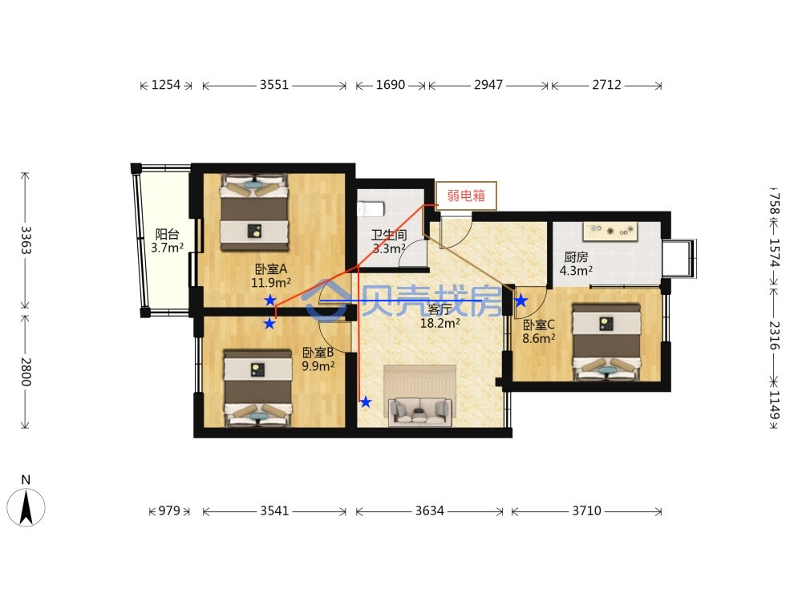
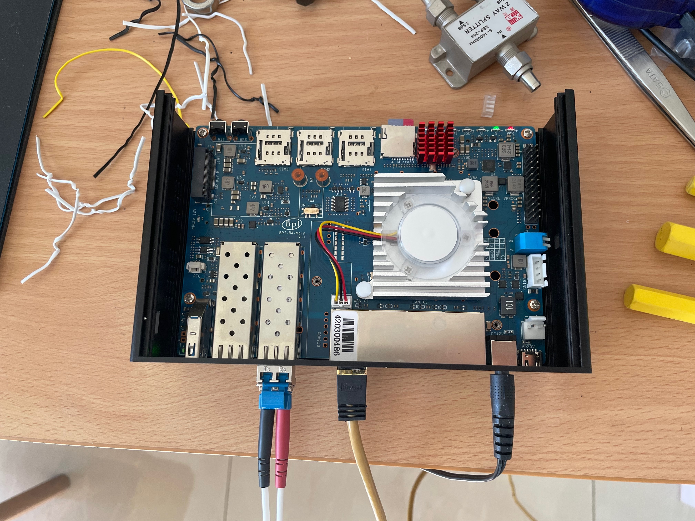
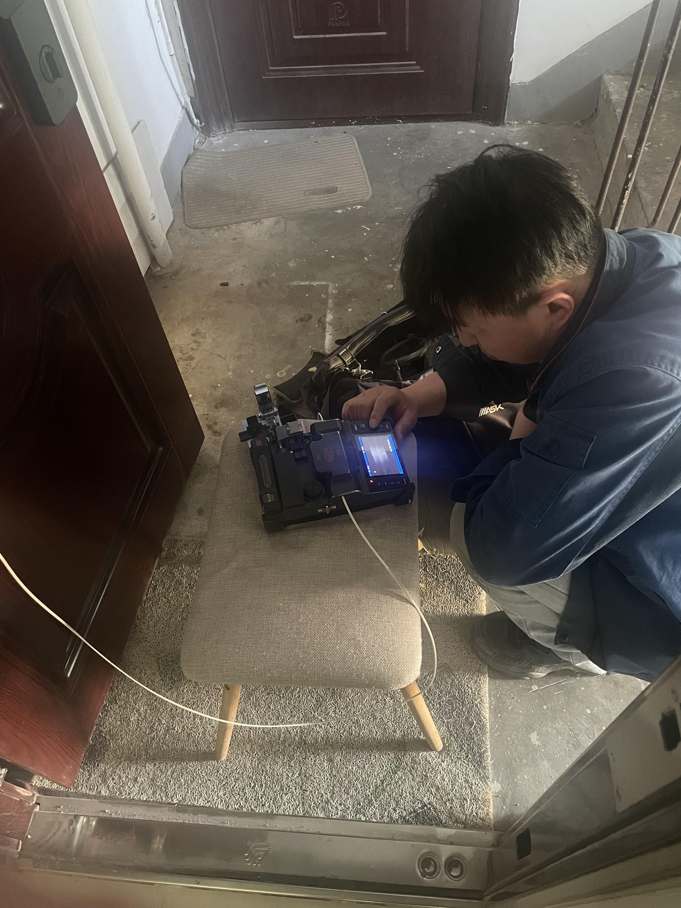
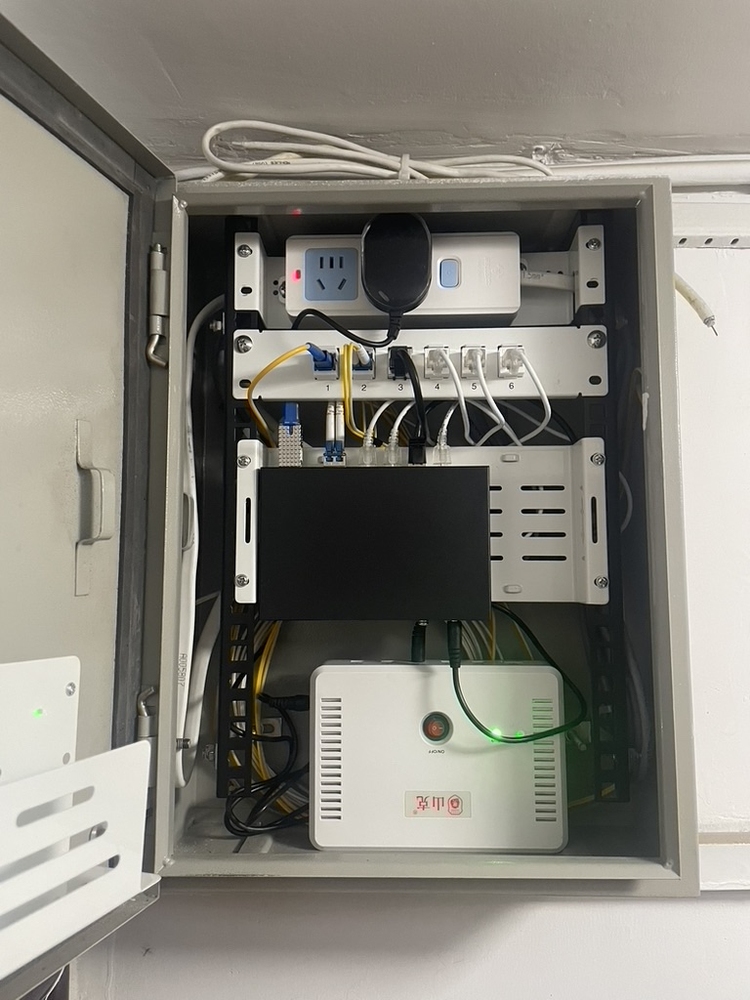
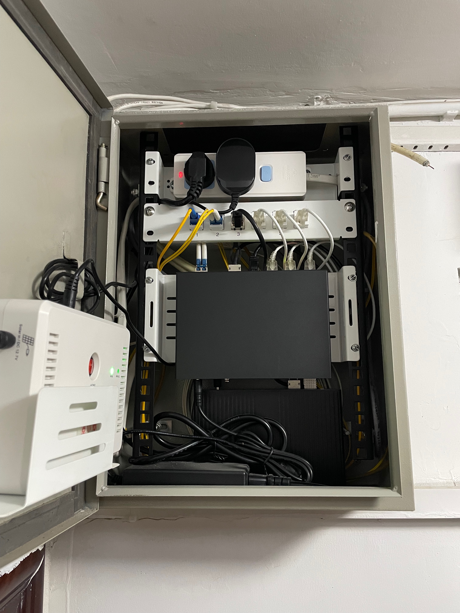
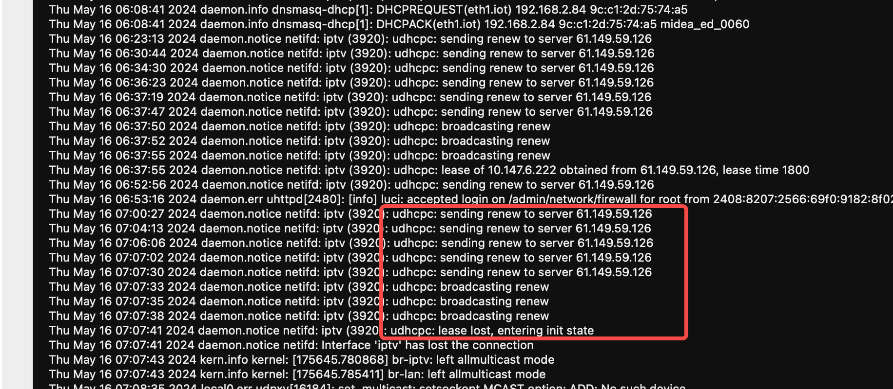

# The Complete Guide to HomeLab Networking

猫棒+主路由拨号+IPTV+IoT(HomeKit/米家)隔离

## 设备清单

- [ODI DFP-34X-2C2](https://hack-gpon.org/ont-odi-realtek-dfp-34x-2c2/)
- [Banana Pi BPI-R4](https://wiki.banana-pi.org/Banana_Pi_BPI-R4)
- [hasivo S600WP-4GT-2SX-SE](https://item.taobao.com/item.htm?_u=31kjapr9f33f&id=752677600501&spm=a1z09.2.0.0.43b42e8dqEZ8iQ&skuId=5362916995459)
- [兮克 SKS3200M-4GPY2XF](https://detail.tmall.com/item.htm?_u=31kjapr99736&id=649809693593&skuId=5805750223574&spm=a1z09.2.0.0.43b42e8dqEZ8iQ)
- [TL-AC100](https://www.tp-link.com.cn/product_347.html)
- [TL-7DR5150易展版](https://www.tp-link.com.cn/product_3434.html)
- [TL-7AP5100HI-PoE易展版](https://www.tp-link.com.cn/product_3304.html)

## 故事

### 源起

22年底装修房子的时候，本着尽快入住的方针，就只做了局部翻新，网络布线没有动。

如下图所示，弱电箱挂在门口楼梯间，预埋有三路网线+同轴电缆，它们穿过卫生间吊顶，然后分别通向两个卧室和客厅。

当然了，图示的走线包含推测成分，这些线路具体怎么转角的我并不清楚，直到如今我准备换线时才发现这些预埋的线缆根本抽不出来，想来是活儿做的并不利落。

当时的网络需求十分简单——全屋Wifi，所以网络拓扑也是分外的简洁：弱电箱放光猫，客厅放Wifi路由器。同时为了简化穿透配置，宽带移机时找师傅把光猫改了桥接，并求了公网IP，然后使用路由器拨号，并且配置DDNS和端口映射。

如此，两个卧室的网口只是徒有其表，并不具备实际功用。凭此问题，一股难言的情绪便一直萦绕心头，时常反复。

### 转折

我一直想把卧室的两个网口实装起来，也研究了单臂路由等方案，但一直没有动手。

2024年春节前夕，久无人居的楼下邻居因为漏水问题找上门来，一番折腾后我决定年后翻修卫生间。

借此机会，我开始重新设计网络结构。

### 演进

在第一个版本的方案中，我计划利用原有的刷了梅林固件的ASUS RT-AX88U，实施单臂路由。然后下单了兮克 SKS3200M-4GPY2XF。

3月31日，花费一天时间研究梅林的文档，单臂路由方案搞定，非常easy。

于是心思开始发散了：想看电视节目？IPTV安排上；交换机是2.5G的，怎么跑满带宽？给RT-AX88U加个2.5G的网卡；交换机光口怎么用？猫棒安排上；还空一个电口怎么用？给书房穿根线吧；网线怎么选？万兆超六类屏蔽线！

至于结果嘛……经过20多天的折腾：猫棒配好了；费了九牛二虎之力，给吊顶开洞下管，最后穿了一根贼粗的秋叶原网线；
RT-AX88U这边则十分不顺利，外接网卡一直掉线，IPTV难配DHCP。硬啃了多日梅林的源码，最后无奈放弃。
这期间又想给书房拉条光纤，皮线or跳线，冷接or熔接……

放弃RT-AX88U做主路由后，我决定转向openwrt平台。在网上一番搜索，最后相中了Banana Pi的BPI-R4。

5月2日，由于调试网络过程中频繁的插拔操作，我把入户光纤的接头搞坏了。感谢联通师傅快速上门维修。

前面说过我想给书房拉条光纤，我这时候决定穿一根单模双芯的LC-LC成品跳线。成品跳线的接口大小是没法穿过已有超六类屏蔽线的20管的，所以我要先把网线抽出来。这根又粗又硬的网线，其穿管的困难程度，光想想就令人想放弃。这就迫使我考虑代替方案的可能性。

早在4月底的时候，我在和朋友的一次会面中得知了细网线这种东西，它主要用于短距离跳线场景。于是我将目标放在了高规格的细网线上。只能说功夫不负有心人。

随着弱电箱中设备和线缆的增加，其混乱程度已令我不忍直视，于是又找了一些改装配件，动手整理。

5月12日，弱电箱整理完成。

为方便调试，这时的猫棒直接插在交换机上，路由器则放在书房中，配置单臂复用。

6月1日，调整猫棒，支持自动协商到2.5G。

直到此时，我仍计划用RT-AX88U来支持全屋wifi。然而，实际测试表明，wifi穿墙后信号强度很差。再加上老婆在卧室的实际体感，和极差的IPTV配置体验，我决定彻底放弃RT-AX88U，转而寻找AC+AP组网方案。

一番调查过后，我发现TP-Link是一个还算可以的低成本平台，在wifi7上有领先的产品布局。这改变了我一直以为对于TP-Link的品牌印象。另外，面板式AP可以使用PoE供电，整洁不占空间，这对卧室环境十分友好。

6月6日，收到客厅AP，安装。

6月7日，弱电箱散热改造。

6月10日，收到AC100。

6月13日，收到PoE交换机、卧室面板AP，安装。

随着openwrt配置基本稳定，为优化线路结构，我便将路由器移到了弱电箱中。猫棒则可以直接插到路由器，也不用再在交换机上配置复杂的vlan。

这一版方案仍不完美：PoE交换机的功率要求大增，小型的路由器UPS已经没法满足供电要求。因此，我又穿了一根从书房到弱电箱的RVV 1.5平的3芯电缆，计划接UPS供电。

## 子网划分

- WAN: VLAN 3961
- IPTV: VLAN 3964, VLAN 4000
- LAN: VLAN 20
- IoT: VLAN 21
- Ctrl: VLAN 42

## AC+AP组网

- [AP](https://openwrt.org/docs/guide-user/network/wifi/dumbap)
- [AC+AP三层组网](https://smb.tp-link.com.cn/service/detail_article_2240.html)

## 猫棒

北京联通的IPTV线路，即使没有加组，也会一直发送CCTV1的数据，使openwrt上的接口统计数据一直涨。如果在意的话。可以在猫棒上开启IGMP Snooping消除不必要的流量。
比较坑爹的是，我所使用的240408版本固件的IGMP Snooping有问题，开启以后在很多情况下正常的组播流量也收不到了。

- [240408 firmware](https://github.com/Anime4000/RTL960x/issues/271#issuecomment-2067501561)
- [SFP EEPROM for 2.5G AutoNeg](https://github.com/Anime4000/RTL960x/discussions/250)

## IPTV

iptv接口在高级设置中勾选“使用默认网关”（Use default gateway），同时设置“使用网关跃点”（Use gateway metric）使其值大于wan接口的对应配置。

勾选“使用默认网关”可以设置网关路由，否则不能连接DHCP服务器，DHCP的Renew可能会失败。

配置“使用网关跃点”则确保iptv接口的默认路由优先级低于wan接口，否则会上不了网。

组播代理使用[omcproxy](https://github.com/openwrt/omcproxy)。开始的时候使用igmpproxy，这个没有luci app不能从web管理，后来看到了omcproxy就换了。使用下来感觉omcproxy更稳定，用igmpproxy总是卡顿。还有一个[mcproxy](https://github.com/mcproxy/mcproxy)，好久没更新了，没有尝试。

组播转单播使用[udpxy](https://github.com/pcherenkov/udpxy)。还有一个[rtp2httpd](https://github.com/oskar456/rtp2httpd)，也有[支持FCC的修改](https://github.com/stackia/rtp2httpd)，但OpenWrt中没有现成的包，所以没有尝试。

尽管omcproxy和udpxy可以共存，没有组播需求的情况下推荐只配置udpxy。

- [IPTV / UDP multicast](https://openwrt.org/docs/guide-user/network/wan/udp_multicast)

## HomeKit

HomeKit设备通过Bonjour（zeroconf）技术实现服务发现自组网。如果同一设备在短时间内以不同的IP接入（如接入的子网发生变化），该设备会被重命名，在原有的名称后追加“(2)”后缀。

OpenWrt的文档中推荐使用[umdns](https://github.com/openwrt/mdnsd)，试了一下，最后发现[不支持作为Repeater](https://openwrt.org/docs/guide-developer/mdns#config_file)。最后换成了avahi。

- [Zero configuration networking in OpenWrt](https://openwrt.org/docs/guide-user/network/zeroconfig/zeroconf)
- [Resolving mDNS across VLANs with Avahi on OpenWRT](https://blog.christophersmart.com/2020/03/30/resolving-mdns-across-vlans-with-avahi-on-openwrt/)
- [局域网设备发现之Bonjour协议](https://www.jianshu.com/p/390f22a6056f)

## Mi Home

米家设备本地控制会限制数据包的来源子网，不是相同子网来的数据包直接不理会。所以，跨子网通信要配置NAT或IP动态伪装（Masquerading）。

## Home Assistant

由于Docker Hub被墙，Matter Server加载项无法安装，需要配置proxy。

HA支持Yeelight集成，其设备自动发现使用魔改的SSDP协议，在我的网络拓扑下需要把组播数据包从lan子网转发到iot子网，可以使用smcroute配置路由。
但因为我已经配置了omcproxy，smcroute添加的路由会被覆盖，最后我停掉了omcproxy。

- [Config docker-daemon.json](https://github.com/home-assistant/operating-system/discussions/2797)
- [Yeelight WiFi Light Inter-Operation Specification](https://www.yeelight.com/download/Yeelight_Inter-Operation_Spec.pdf)

## 其它参考

- [在 AX88U + Merlin 384.19 上配置基于 RTL8156B 的 2.5GbE 网卡](https://wu.renjie.im/blog/network/ax88u-nbase-t/zh-cn/)
- [Towards 2.5GbE (NBASE-T) on ASUS RT-AX88U with RTL8156B and Asuswrt-Merlin 384.19](https://wu.renjie.im/blog/network/ax88u-nbase-t/)
- [Need help to compile Realtek r8152 driver for RT-AX88U](https://www.snbforums.com/threads/need-help-to-compile-realtek-r8152-driver-for-rt-ax88u.89035/)
- [Compiling Realtek RTL 8152, 8156 and 8157 drivers for QNAP NAS](https://gist.github.com/RikshaDriver/0388ba3f38f89eb975ebb0b915860ec2)
